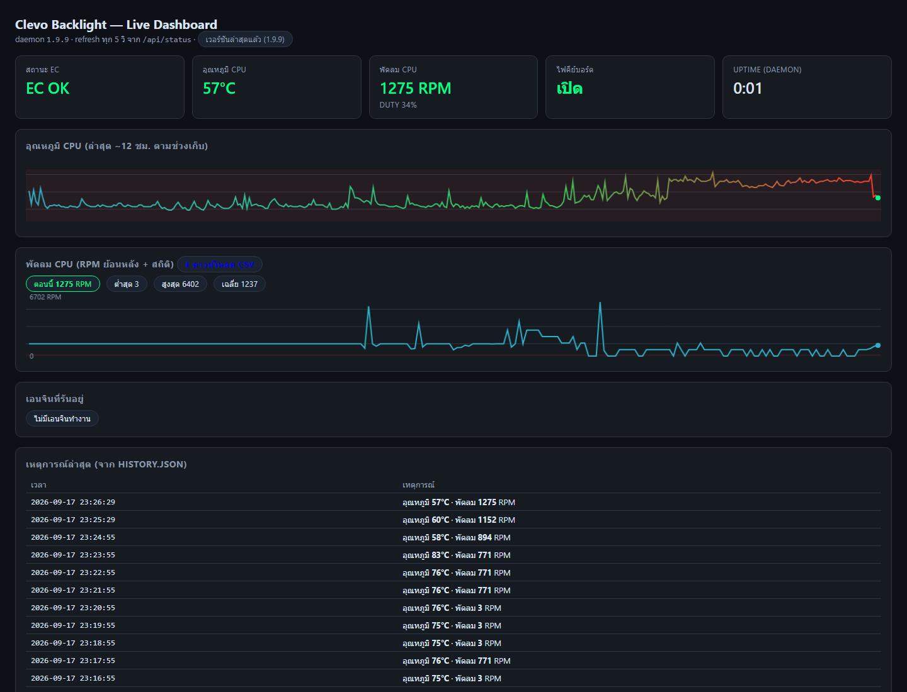

# Clevo N957TP6 Keyboard Backlight Controller

[](https://github.com/NarDecH/ClevoBacklight/actions/workflows/release.yml)
[](https://github.com/NarDecH/ClevoBacklight/releases/latest)
[](https://github.com/NarDecH/ClevoBacklight)
[](https://github.com/NarDecH/ClevoBacklight)
[](LICENSE)

ชุดเครื่องมือควบคุมแสงไฟคีย์บอร์ด (backlight / RGB 3 โซน) สำหรับ Clevo N957TP6 / N9xTP6 ที่ใช้ BIOS ดัดแปลง (dsanke) บน Windows — สั่งงาน EC (Embedded Controller) โดยตรงผ่านไดรเวอร์ WinRing0 ไม่ต้องพึ่ง Control Center หรือ WMI ซึ่งใช้ไม่ได้บนเครื่องนี้

**สถานะ: ใช้งานได้จริง ยืนยันบนฮาร์ดแวร์แล้ว** ✅ — สี 3 โซน, ความสว่าง 4 ระดับ, เปิด/ปิดไฟ ผ่านการทดสอบด้วยสายตาทั้งหมด (ดูรายละเอียดท้ายไฟล์)

## ภาพหน้าตาโปรแกรม



> ภาพจริงจาก Dashboard บนเครื่อง (เปิดจาก tray icon หรือ `http://127.0.0.1:8787` หลังรัน daemon) — แสดงการ์ดอุณหภูมิ/พัดลม, กราฟย้อนหลัง, แผงสลับโหมดเรียลไทม์ (Music/Ambient/Temp), Events viewer และแผงตั้งค่าแจ้งเตือน

**ฟีเจอร์เด่น**

| ฟีเจอร์ | รายละเอียด |
|---|---|
| 🎨 สีรายโซน | 3 โซน (ซ้าย/กลาง/ขวา) เลือกสีอิสระ + พาเลต 12 สีคลิกเดียวทั้งแถบ |
| 💡 ความสว่าง | 4 ระดับ (63/126/189/252) |
| ✨ โหมดเอฟเฟกต์ | Random / Dance / Tempo / Flash / Wave / Breathe / Cycle + ปรับความเร็ว 0–9 (ขึ้นกับเฟิร์มแวร์) |
| 🎵 **Music reactive** | ไฟกระพริบตามจังหวะเสียงระบบ — BASS/MID/TREBLE แยกโซน (WASAPI loopback + FFT) |
| 🌡️ **Temperature reactive** | ไล่สี cyan → เขียว → เหลือง → แดงตามความร้อน CPU/GPU (อ่านจาก EC RAM โดยตรง) กระพริบเตือน ≥90°C |
| ⌨️ Global hotkeys | ปุ่มลัดทำงานได้แม้โฟกัสอยู่ในเกม (กำหนดเองได้ผ่าน GUI) |
| 🔁 Daemon autostart | คืนค่าไฟเองหลัง boot / sleep / ต่อ dock + tray icon |
| 🖥️ **Ambient mode** | ไฟเปลี่ยนสีตามหน้าจอจริง (สไตล์ Ambilight, DirectX capture) |
| 🎛️ **Color profiles** | โปรไฟล์สีตั้งชื่อได้ (Gaming/Work/Night) สลับผ่าน GUI/tray/hotkey/CLI |
| 🎮 **Game auto-profile** | เปิดเกม (foreground = ไฟล์ .exe ที่กำหนด) → สลับโปรไฟล์อัตโนมัติ ปิดเกมแล้วกลับเอง · ตั้งกฎจาก Dashboard พร้อมปุ่ม "จับแอปฟื้กซ์" (v1.9.20) · แจ้งเตือนเมื่อสลับได้ (เปิดในแผงแจ้งเตือน) |
| ⏰ **Day schedule** | เปลี่ยนโปรไฟล์ตามเวลา (เช่น 22:00 → night) ข้ามเที่ยงคืนได้ |
| 🩺 **Health check** | daemon ตรวจ EC + อุณหภูมิ CPU เป็นระยะ เขียน `status.json` ให้เครื่องมืออื่นอ่าน (ดูย่อได้จาก tray) |
| 📊 **Live Dashboard** | เว็บสถานะสดที่ `http://127.0.0.1:8787` — กราฟอุณหภูมิย้อนหลัง + เอนจินที่รัน (เปิดจาก tray) |
| 🔔 **Toast แจ้งเตือน** | Windows notification เมื่อ EC อ่านไม่ได้/กลับมาปกติ, CPU เกิน threshold, เอนจินหยุดเอง |
| 🧩 **Hardware profiles** | map เซ็นเซอร์ต่อรุ่น (`hardware.profile`) + `--dump-ec --diff` / `ec_sensor_finder.py` ช่วยหา address บนเครื่อง Clevo รุ่นอื่น |
| 🗂️ **Event log** | `events.jsonl` บันทึกเหตุการณ์ทั้งหมดแบบโครงสร้าง — วิเคราะห์ย้อนหลังได้ (`--export-events`) |
| 🌀 **Fan monitor** | อ่าน RPM/duty พัดลมสด ๆ (1 Hz) — *ควบคุมไม่ได้โดย design ของ EC รุ่นนี้* (พิสูจน์แล้ว ดู RESEARCH.md) |
| 📦 ไฟล์เดียวจบ | แพ็กเป็น `ClevoBacklight.exe` ได้ (GUI + daemon + CLI + music + ambient) |

---

## สารบัญ

1. [ทำไมต้องเขียน EC ตรง?](#ทำไมต้องเขียน-ec-ตรง)
2. [สถาปัตยกรรมของระบบ](#สถาปัตยกรรมของระบบ)
3. [เริ่มใช้งานอย่างรวดเร็ว](#เริ่มใช้งานอย่างรวดเร็ว)
4. [GUI — คู่มือทุกปุ่ม](#gui--คู่มือทุกปุ่ม)
5. [Music reactive mode](#music-reactive-mode)
6. [CLI — คำสั่งทั้งหมด](#cli--คำสั่งทั้งหมด)
7. [Daemon — ทำงานเบื้องหลัง + Hotkeys](#daemon--ทำงานเบื้องหลัง--hotkeys)
8. [Autostart — เปิดเครื่องแล้วไฟกลับมาเอง](#autostart--เปิดเครื่องแล้วไฟกลับมาเอง)
9. [settings.json — รูปแบบการตั้งค่า](#settingsjson--รูปแบบการตั้งค่า)
10. [โปรโตคอล EC (สำหรับผู้อยากรู้)](#โปรโตคอล-ec-สำหรับผู้อยากรู้)
11. [แพ็กเป็น ClevoBacklight.exe](#แพ็กเป็น-clevobacklightexe)
12. [โครงสร้างไฟล์](#โครงสร้างไฟล์)
13. [ผลการทดสอบบนเครื่องจริง](#ผลการทดสอบบนเครื่องจริง)
14. [แก้ปัญหา](#แก้ปัญหา)
15. [ข้อควรระวังด้านความปลอดภัย](#ข้อควรระวังด้านความปลอดภัย)

---

## ทำไมต้องเขียน EC ตรง?

ตรวจสอบบนเครื่องนี้แล้ว ช่องทางมาตรฐานทั้งหมดใช้ไม่ได้:

| ช่องทาง | สถานะ | เหตุผล |
|---|---|---|
| WMI ของ Clevo (`ABBC0F6D-…`) | ❌ | DSDT มีบล็อก `_WDG` อยู่จริง แต่ไม่ถูกลงทะเบียนใน `root\WMI` (ไม่มี MOF) |
| Control Center 3.0 (Store) | ❌ | ต้องการไดรเวอร์ Insyde DCHU (GUID `{86994C74-…}`) ซึ่งไม่ได้ติดตั้ง — RGB ในแอปจึงกดแล้วไม่มีผล |
| `\\.\ACPI` (IOCTL_ACPI_EVAL_METHOD_EX) | ❌ | symlink ไม่มีบน Windows build นี้ (26200) |
| `GetSystemFirmwareTable` | ❌ | ถูกปิดแม้ยกระดับ admin |
| HID USB (ITE 8291) | ❌ | คีย์บอร์ดภายในเป็น PS/2 (`ACPI\MSFT0001`) ไม่มีคอนโทรลเลอร์ ITE แบบ USB |

ทางที่เหลือคือ **เขียน EC RAM ตรง ๆ ผ่านพอร์ต 0x62/0x66** โดยใช้ไดรเวอร์ **WinRing0x64.sys** (ลงนาม Valid, v1.2.0.5) ที่โปรแกรมติดตั้ง/เรียกใช้เองแบบ on-demand — โปรโตคอล mailbox ทั้งหมดถอดรหัสจาก **DSDT ของเครื่องนี้เอง** (ไม่เดาจากเครื่องอื่น)

## สถาปัตยกรรมของระบบ

```
┌──────────────────────────────────────────────────────────────────┐
│                       ชั้นผู้ใช้ (4 ทางเลือก)                       │
│                                                                  │
│  Clevo-Backlight-GUI.bat ──► clevo_backlight_gui.py (GUI+music)  │
│  clevo_ec.py --color …    ──► clevo_ec.py (CLI)                  │
│  clevo_music.py           ──► โหมดตามเสียงเพลง (แยกต่างหากก็ได้)    │
│  daemon (autostart)       ──► clevo_daemon.py + tray + hotkeys   │
│                               + game watcher + day scheduler      │
├──────────────────────────────────────────────────────────────────┤
│  config.py  : settings.json (บันทึก/อ่าน/restore + hotkey parser) │
│  hotkeys.py : RegisterHotKey (global hotkey เธรดเดียว ปลอดภัย)     │
│  clevo_music.py : WASAPI loopback → FFT → 3 แถบพลังงานเสียง       │
│  clevo_ambient.py : DirectX screen capture → สีเฉลี่ยรายคอลัมน์    │
├──────────────────────────────────────────────────────────────────┤
│  clevo_ec.py : WinRing0 loader + EC port I/O + mailbox protocol  │
│                (ถอดรหัสจาก DSDT ของเครื่องนี้) + CLI              │
├──────────────────────────────────────────────────────────────────┤
│  WinRing0x64.sys (ลงนามแล้ว) ──► ports 0x62/0x66 ──► EC ──► LED   │
└──────────────────────────────────────────────────────────────────┘
```

ทุกทางเลือกใช้ **settings.json ไฟล์เดียวกัน** — ตั้งค่าที่ไหนก็ได้ ที่เหลือ restore ให้เอง

## เริ่มใช้งานอย่างรวดเร็ว

**ทางลัดที่ง่ายที่สุด:**

```
ดับเบิลคลิก  Clevo-Backlight-GUI.bat   → GUI เปิดเลย (ขอ admin ครั้งเดียว)
ดับเบิลคลิก  Install-Autostart.bat      → ติดตั้ง daemon: ไฟคืนค่าเอง + hotkeys + tray
ดับเบิลคลิก  Remove-Autostart.bat        → ถอน daemon
```

*(ถ้า build `.exe` แล้ว — ดู [แพ็กเป็น ClevoBacklight.exe](#แพ็กเป็น-clevobacklightexe) — ทั้งสอง .bat จะหยิบ exe มาใช้ให้เอง)*

หรือแบบ command line (ต้องเปิด PowerShell แบบ Run as Administrator เอง):

```powershell
python clevo_ec.py --on --color 00FF88 --brightness 3
```

## GUI — คู่มือทุกปุ่ม

เปิดด้วย `Clevo-Backlight-GUI.bat` (หรือ `python clevo_backlight_gui.py` ใน terminal admin)

| ส่วน | คำอธิบาย |
|---|---|
| **Power ON / OFF** | เปิดหรือปิดไฟทั้งคีย์บอร์ด — กด ON จะใช้ค่าที่ตั้งไว้ทันที |
| **บันทึกเป็นค่าเริ่มต้น** | เซฟสถานะปัจจุบันลง settings.json — daemon จะใช้ค่านี้ตอน boot/resume |
| **Brightness 0–3** | 4 ระดับ (raw 63/126/189/252) |
| **Effect speed 0–9** | ความเร็วเอฟเฟกต์ (0 = เร็วสุด) — ใช้เมื่อโหมดไม่ใช่ Custom |
| **Zone colors** | คลิกแถบสีซ้าย/กลาง/ขวาเพื่อเปิดจานสี — เปลี่ยนเฉพาะโซนนั้น |
| **Palette presets** | 12 สีเตรียมไว้ — คลิกแล้ว apply ทั้งแถบทันที (แก้พาเลตได้ใน settings.json) |
| **Effect mode** | Custom / Random / Dance / Tempo / Flash / Wave / Breathe / Cycle |
| **Music reactive** | ดูหัวข้อถัดไป |
| **Ambient (screen colors)** | ดูหัวข้อ "Ambient mode" |
| **Color profiles** | ปุ่มโปรไฟล์ (● = กำลังใช้) — คลิกเพื่อ apply ทันที + บันทึกเป็นค่าหลัก |
| **Global hotkeys** | ปุ่ม "ตั้งค่า hotkeys…" — คลิกช่องแล้วกดคีย์ที่ต้องการ ระบบจับให้เอง |
| **Status** | แสดงผลการทำงานทุกคำสั่งแบบ real-time |

**พฤติกรรมอัตโนมัติของ GUI:**
- ทุกการเปลี่ยนแปลง **บันทึกลง settings.json ทันที** (ไม่ต้องกดเซฟ — ปุ่มบันทึกไว้ fix ค่าเริ่มต้นชัดเจน)
- เปิด GUI ขึ้นมา = apply ค่าที่เซฟไว้ทันที
- กลับจาก sleep (หายไป >60 วิ) = **คืนค่าไฟอัตโนมัติหลัง 1.5 วิ** — เผื่อ EC ตื่นไม่ทัน
- เปลี่ยนสี/เลือก preset จะเปิดไฟให้เองถ้ายังปิดอยู่ (ประสบการณ์ใช้งานลื่นกว่า)
- เริ่มการทำงานใด ๆ (สี/โหมด/preset) จะ**หยุด music mode ให้ก่อนเสมอ** กันคำสั่งชนกัน

## Music reactive mode

ไฟคีย์บอร์ดเต้นตาม**เสียงที่เครื่องกำลังเล่น** (เพลง/วิดีโอ/เกม) โดยไม่ต้องไมโครโฟน — อ่านจาก **WASAPI loopback** ของการ์ดเสียงโดยตรง

```
เสียงระบบ → loopback 48kHz → FFT (Hanning window)
  → BASS   20–250 Hz    → โซนซ้าย
  → MID    250–2 kHz    → โซนกลาง
  → TREBLE 2–16 kHz     → โซนขวา
แต่ละแถบ: RMS พลังงาน → adaptive noise floor (เงียบ = ดับ)
  → attack/decay envelope (ปลายขึ้นไว 0.55 / ปล่อยช้า 0.12)
  → beat detector (เบสกระโดด = แฟลชเพิ่ม 35%)
→ เขียนสีรายโซน (สีพื้น × พลังงาน) ทุก ~30ms
```

**ใน GUI:**

| คอนโทรล | คำอธิบาย |
|---|---|
| ▶ เริ่มตามเสียงเพลง / ■ หยุด | สลับโหมด — หยุดแล้วคืนสีคงที่เดิมให้เอง |
| สีไล่เฉดเดียว (checkbox) | ใช้สีเดียวไล่มืด→สว่าง 3 โซน (แก้สีที่ช่องสีข้าง ๆ) — ไม่ติ๊ก = ใช้สีรายโซนที่ตั้งไว้ |
| Sensitivity 0.2–3.0 | คูณกำไร — **ปรับสดได้ระหว่างเล่น** ไม่ต้องกดหยุด (เบา <0.8, ดัง ~1.0, หูตาย >1.5) |
| แถบ BASS/MID/TRE | เอฟเฟกต์เล็กแสดงพลังงานแต่ละแถบตามเวลาจริง (สีตามโซนจริงที่กำลังเขียน) |

**ผ่าน CLI (รันแยกเลยก็ได้):**

```powershell
python clevo_music.py --list-devices        # ดูอุปกรณ์ loopback ทั้งหมด
python clevo_music.py                       # ใช้สีรายโซนที่เซฟไว้
python clevo_music.py --color FF0080        # ไล่เฉดจากสีเดียว
python clevo_music.py --sensitivity 1.5 --floor 0.15
python clevo_ec.py --music --sensitivity 1.2   # ทางเลือกผ่าน CLI หลัก
```

พารามิเตอร์: `--sensitivity` (กำไร), `--floor` (ความสว่างขั้นต่ำ 0–1, default 0.12 กันสีจางจนจำไม่ได้), `--interval` (ช่วงห่างเขียน EC วินาที, default 0.03), `--device` (เลือกอุปกรณ์เสียงเฉพาะชื่อย่อย)

**ข้อจำกัด:** เสียงต้องเล่นผ่านอุปกรณ์ default output (Realtek Speakers ของเครื่องนี้มี loopback ให้ใช้); เสียงผ่าน HDMI/Bluetooth ต้องระบุ `--device`; ใช้ CPU ~1–2% (FFT block 1024)

## Ambient mode

ไฟคีย์บอร์ดเปลี่ยนสีตาม**สีหน้าจอจริง** (สไตล์ Ambilight) — จับหน้าจอด้วย DirectX Desktop Duplication (ผ่าน `mss`), แบ่งเป็น 3 แถบแนวตั้งซ้าย/กลาง/ขวา แล้วส่งสีเฉลี่ยของแต่ละแถบเข้าโซนนั้น

```
หน้าจอ → จับเฟรม (DirectX/mss, ย่อเหลือ 96×54 จุด)
  → แถบซ้าย → สีเฉลี่ย → gamma 1.6 (ดันฉากมืดให้ยังเห็น hue)
  → แถบกลาง → สีเฉลี่ย → ┐
  → แถบขวา  → สีเฉลี่ย → ┘
→ ผสมกับสีที่เซฟไว้ตาม Mix (0 = สีที่เซฟ, 1 = สีจอล้วน, default 0.35)
→ smoothing attack/decay (ไฟไหล่ลื่น ไม่กระพริบสั่น)
→ เขียน EC ทุก 0.25 วิ (ปรับได้)
```

**ใน GUI:** ปุ่ม ▶ เริ่มตามสีหน้าจอ / ■ หยุด + สไลเดอร์ Mix **ปรับสดระหว่างเล่นได้**

**ผ่าน CLI (รันแยกเลยก็ได้):**

```powershell
python clevo_ambient.py                    # default mix 0.35
python clevo_ambient.py --mix 0.6          # สีจอชัดขึ้น
python clevo_ambient.py --interval 0.15    # ตอบสนองไวขึ้น (CPU ขึ้นตาม)
python clevo_ec.py --ambient --mix 0.5     # ทางเลือกผ่าน CLI หลัก
```

**ข้อจำกัด:** ต้องมี `mss` (`pip install mss`) ไม่งั้น fallback เป็น PIL ImageGrab (ช้ากว่า); เนื้อหาป้องกันการจับ (Netflix/DRM) จะได้สีดำ — เป็นข้อจำกัดของระบบปฏิบัติการ; ใช้ CPU ~2–4% ที่ interval 0.25

## Color profiles

โปรไฟล์ = ชุดค่า (brightness + สี 3 โซน + โหมด + ความเร็ว) ตั้งชื่อเก็บไว้สลับใช้ทันที — ค่าเริ่มต้นมี 3 โปรไฟล์: `gaming` (แดง สว่างสุด), `work` (ฟ้าอ่อน ระดับ 2), `night` (ส้ม หรี่สุด)

**สลับโปรไฟล์ได้ 4 ทาง:**

| ทาง | วิธี |
|---|---|
| GUI | คลิกปุ่มชื่อโปรไฟล์ (● = กำลังใช้) |
| Tray | คลิกขวา tray icon → เมนูโปรไฟล์ / "โปรไฟล์ถัดไป" |
| Hotkey | `Ctrl+Alt+P` = วนโปรไฟล์ถัดไป (แก้ได้ใน settings.json) |
| CLI | `python clevo_ec.py --profile night` |

การ apply โปรไฟล์จะ**เขียนทับค่าหลักทันที** (เปิดไฟ + ตั้งค่าทุกอย่าง + mark `active_profile` + เซฟ settings.json) — daemon restore กลับเข้าโปรไฟล์ล่าสุดเสมอ และเอฟเฟกต์เรียลไทม์ (music/ambient) จะถูกหยุดก่อนสลับโปรไฟล์อัตโนมัติ

**เพิ่ม/แก้โปรไฟล์:** แก้ settings.json ตรง ๆ (ค่าผิดรูปจะถูก validate + fallback อัตโนมัติ):

```json
"profiles": {
  "gaming": {"brightness": 3, "colors": ["FF3B30", "FF3B30", "FF3B30"], "mode": "custom", "speed": 4},
  "movie":  {"brightness": 1, "colors": ["007AFF", "007AFF", "007AFF"], "mode": "breathe", "speed": 6}
}
```

## Automation — Game auto-profile & Day schedule

ทำงานเบื้องหลังใน daemon (ตั้งค่าใน GUI สองแผงล่าง, **การ์ด "สลับโปรไฟล์อัตโนมัติตามแอป" บน Dashboard/มือถือ (v1.9.17)** หรือแก้ settings.json ตรง ๆ)

**🎮 Game auto-profile** — ทุก ~5 วิ daemon ดูว่าหน้าต่างโฟกัสเป็นของโปรเซสไหน (อ่านชื่อ .exe แบบ light-weight ไม่แตะ title): ถ้าอยู่ในรายการ → apply โปรไฟล์นั้นทันที; ปิดเกม → กลับไปโปรไฟล์ `restore_profile` — เพิ่ม/ลบกฎจากหน้าเว็บได้ผ่าน `POST /api/auto_profiles` (ต้องเปิด allow_control; ลบกฎส่งค่า `null`)

```json
"auto_profiles": {
  "enabled": true,
  "games": {"cyberpunk2077.exe": "gaming", "valorant.exe": "gaming"},
  "restore_profile": "work",
  "poll_seconds": 5
}
```

**⏰ Day schedule** — เปลี่ยนโปรไฟล์ตามเวลาของวัน (นาฬิกาเครื่อง); ก่อนช่วงแรกของวันใช้ช่วงสุดท้ายข้ามเที่ยงคืน (เช่น 22:00 → night จะครอบคลุมถึง 07:59 ของเช้าถัดไป)

```json
"schedule": {
  "enabled": true,
  "slots": [
    {"time": "08:00", "profile": "work"},
    {"time": "22:00", "profile": "night"}
  ]
}
```

**กติกา:** เกมชนะ scheduler เสมอ (เปิดเกมตอนกลางคืนก็ได้โปรไฟล์ gaming) · ทุกกฎ debounce — ไม่เขียน EC ซ้ำถ้าสถานะไม่เปลี่ยน · แก้ค่าได้ระหว่างรัน daemon อ่านค่าใหม่ทุก poll ไม่ต้องรีสตาร์ท · ค่า .exe/ชื่อโปรไฟล์ที่ผิดจะถูก validate ทิ้งอัตโนมัติ

## Temperature reactive mode

ไฟคีย์บอร์ดเปลี่ยนสีตาม**ความร้อนจริงของเครื่อง** — อ่านอุณหภูมิจาก EC RAM โดยตรง:

| แหล่ง | EC RAM | การยืนยัน |
|---|---|---|
| **CPU** | `0x07` | อ่านได้ 45°C ตรงกับ Windows thermal zone (45.1°C) เป๊ะ |
| **GPU** | `0x08` | คู่ CPU ตาม convention Clevo (ตรวจซ้ำด้วย `--read` ระหว่างเล่นเกม) |

```
≤35°C  cyan-green หรี่ (idle) → 50°C เขียว → 62°C เหลือง → 75°C ส้ม
→ 85°C แดงส้ม → ≥95°C แดงสุด · ≥90°C กระพริบเตือน (1 Hz)
ความสว่างไล่ 35%→100% ตามความร้อน (35–85°C) · เปลี่ยนสีนุ่มไม่กระตุก · อ่านทุก 2 วิ
```

**ใน GUI:** แผง Temperature reactive — ▶ เริ่ม/■ หยุด + เลือกแหล่ง cpu/gpu + ตัวเลข °C แบบเรียลไทม์

```powershell
python clevo_temp.py --source gpu     # รันแยก
python clevo_ec.py --temp             # ทางเลือกผ่าน CLI หลัก (default CPU)
```

## Battery saver mode

ถอดปลั๊ก = daemon จัดการให้เอง (เช็ก `GetSystemPowerStatus` ทุก 10 วิ):

| สถานะ | การกระทำ |
|---|---|
| **บนแบต** | จำกัดความสว่างไม่เกินระดับที่ตั้ง และ/หรือ apply โปรไฟล์ประหยัด (เช่น `work` หรี่ ๆ) — **ไม่แก้ค่าที่เซฟไว้** |
| **บนแบต + ต่ำกว่า `low_percent`** | หรี่ตาม cap เดิม (ถ้าตั้ง `low_percent` ไว้) |
| **บนแบต + ต่ำกว่าครึ่งหนึ่งของ `low_percent`** | **หรี่เหลือระดับ 1** (critical — เหลือไฟนิดเดียวกันพอเห็น) |
| **เสียบปลั๊กกลับ** | คืนค่าหลักจาก settings.json ทันที |

ตั้งค่าใน GUI แผง "Battery saver" (เปิดใช้งาน + โปรไฟล์บนแบต + ความสว่างสูงสุด + **หรี่เพิ่มเมื่อแบตต่ำกว่า %**) หรือแก้ settings.json: `"battery": {"enabled": true, "profile": "", "brightness": 1, "low_percent": 25}`

## Notifications (toast จาก daemon)

เปิด/ปิดได้ทุกอันจาก GUI แผง **Notifications** (หรือ settings `notifications`): EC ล่ม / EC กลับมา / **CPU ร้อนเกินเกณฑ์** (75–100°C, hysteresis 5°) / **พัดลมหยุดหมุน** (RPM=0 ขณะ ≥ เกณฑ์−10°, dedup ต่อตอน)

## สรุปรายวันบน Dashboard

daemon รวม history เป็น**สถิติรายวัน** (`daily_stats.json` เก็บ 60 วัน): อุณหภูมิเฉลี่ย/สูงสุด, RPM เฉลี่ย/สูงสุด, จำนวน EC fail, uptime — dashboard แผง "สรุปรายวัน" วาดกราฟแท่ง 30 วัน (สีตามพีค: เขียว/ส้ม/แดง) + ตาราง 14 วันล่าสุด · API: `GET /api/daily`

แผง **สรุปรายสัปดาห์** จัดกลุ่มเป็น ISO week: พีคอุณหภูมิ/RPM, EC fail รวม, **วันที่ร้อนสุดของสัปดาห์** + บอก**ชั่วโมงที่เคยวัดร้อนสุด**จาก history (`GET /api/weekly`)

## รีโมตจากมือถือ / หน้าเว็บ (opt-in)

เปิด checkbox **"อนุญาตให้ควบคุมไฟจากหน้าเว็บ"** ในแผง Dashboard ของ GUI แล้วหน้าเว็บ (localhost หรือ LAN พร้อม token) จะมีปุ่ม: **power เปิด/ปิด · ความสว่าง 0–3 · โปรไฟล์ทุกตัว · โหมดเรียลไทม์ music/ambient/temp (▶/■) · ⚡ Quick Actions (พรีเซ็ตกลางคืน/เกมมิ่ง/ทำงาน)** — ส่งเป็น `POST /api/cmd` `{"action": "power|brightness|profile|engine|light", ...}` ผ่าน daemon (ปิดโดย default) · สั่ง EC เหมือนกด hotkey — **ไม่แก้ settings ที่เซฟไว้**

**สั่งจาก Home Assistant / สคริปต์ (v1.9.21)** — action `light`: สีต่อโซน 1–3 ช่อง (hex) + brightness + mode + speed โดยไม่บันทึกทับโปรไฟล์ และตั้ง `restore` ให้กลับโปรไฟล์เดิมเองหลัง N วินาที:

```bash
curl -X POST http://127.0.0.1:8787/api/cmd?token=TOKEN \
  -H "Content-Type: application/json" \
  -d '{"action":"light","zones":["ff0000","00ff00"],"brightness":2,
       "mode":"breathe","speed":6,"restore":"work","restore_after":300}'
```

HA example (rest_command):

```yaml
rest_command:
  kb_light:
    url: http://PC-IP:8787/api/cmd?token=YOUR_TOKEN
    method: POST
    payload: '{"action":"light","zones":["{{ zones }}"],"brightness":{{ level }}}'
```

## Discord webhook

ใส่ URL webhook ใน GUI แผง Notifications (หรือ `notifications.discord_webhook`) แล้วได้รับ:
- ทุก toast แจ้งเตือนที่ผ่านเกณฑ์ (EC ล่ม/กลับมา, CPU ร้อน, พัดลมหยุด)
- **สรุปรายวันอัตโนมัติ** ตอนเปลี่ยนวัน: อุณหภูมิเฉลี่ย/พีค, RPM เฉลี่ย, จำนวน EC fail

ไม่มี dependency เพิ่ม (HTTP ตรง) — webhook พลาดแล้ว log ไว้ใน daemon.log แทน crash

## Telegram notifications

เหมือน Discord แต่ผ่านบอทของคุณเอง: สร้างบอทจาก **@BotFather** (ได้ token) → หา chat_id ของคุณ (เช่นจาก **@userinfobot**) → ใส่ทั้งสองค่าใน GUI แผง Notifications (token ซ่อนเป็น ***) จะได้แจ้งเตือน + สรุปรายวันเข้า Telegram (`notifications.telegram_token` / `telegram_chat_id`)

## เกรดสุขภาพเครื่อง (Dashboard)

แผง **สุขภาพเครื่อง** ให้เกรด A–F จากข้อมูล 30 วันล่าสุด (คะแนนเต็ม 100): อุณหภูมิพีค (40 คะแนน) + วันพัดลมนิ่ง (30) + ความน่าเชื่อถือของ EC (30) — เกรด A ≥85, B ≥70, C ≥50, D ≥30, F ต่ำกว่า · ดูได้จาก `GET /api/daily` field `health`

## สำรอง / กู้คืนข้อมูล

daemon สำรอง `settings.json` + `history.json` + `daily_stats.json` ไป `backups/` **วันละ 1 ชุดอัตโนมัติ** เก็บย้อนหลัง 7 ชุด + **zip รายสัปดาห์** (`week-<ISO>.zip` เก็บ 4 สัปดาห์) — จัดการได้จากแผง **สำรอง & กู้คืน** บน Dashboard: ดูรายการ · ดาวน์โหลด zip · ปุ่ม "สำรองเดี๋ยวนี้" · **กู้คืนแบบไม่ต้องรีสตาร์ท** (settings reload ผ่าน loader ปกติ แล้วดันโปรไฟล์ active กลับเข้าไฟเอง)

```powershell
python clevo_ec.py --list-backups            # ดู stamp ที่มี
python clevo_ec.py --restore-backup 2026-09-17_12-00   # กู้คืน (มีผลทันทีตั้งแต่ v1.9.22)
```

API: `GET /api/backups` (list) · `GET /api/backups/<file>` (ดาวน์โหลด) · `POST /api/backups/restore {"file":"<stamp>__settings.json"}`

## ความสมบูรณ์ของ release (v1.9.22)

ทุก release แนบ `SHA256SUMS.txt` (CI สร้างจาก zip + Setup) · daemon อ่าน `digest` จาก GitHub API แล้ว**ตรวจไฟล์ที่ดาวน์โหลดก่อนใช้เสมอ** — ไม่ผ่าน = ลบทิ้ง + toast เตือน + event `download_rejected` (release เก่าที่ไม่มี digest ยังใช้ได้เหมือนเดิม)

## CLI — คำสั่งทั้งหมด

```powershell
python clevo_ec.py --read              # อ่านค่า EC (ทดสอบการเชื่อมต่อ ไม่มีการเขียน)

python clevo_ec.py --on                # เปิดไฟ
python clevo_ec.py --off               # ปิดไฟ
python clevo_ec.py --brightness 2      # ความสว่าง 0-3

python clevo_ec.py --color FF8000      # สีทั้งคีย์บอร์ด (RRGGBB)
python clevo_ec.py --zone 2 --color FF0000   # เฉพาะโซน (0=ซ้าย 1=กลาง 2=ขวา)

python clevo_ec.py --mode breathe      # random|dance|tempo|flash|wave|breathe|cycle
python clevo_ec.py --mode wave --speed 2

python clevo_ec.py --music             # โหมดตามเสียงเพลง (Ctrl+C หยุด)
python clevo_ec.py --music --sensitivity 1.4

python clevo_ec.py --profile night     # apply โปรไฟล์ชื่อ night (ดูหัวข้อ Color profiles)
python clevo_ec.py --ambient --mix 0.5 # โหมดตามสีหน้าจอ (Ctrl+C หยุด)
python clevo_ec.py --temp --source gpu # โหมดตามอุณหภูมิ (Ctrl+C หยุด)
python clevo_ec.py --temp --reg 0x07   # ระบุ address EC RAM ของเซ็นเซอร์เอง (เครื่องรุ่นอื่น)
python clevo_ec.py --ambient --mix 0.5 --interval 0.1   # ambient อัปเดตเร็วขึ้น

python clevo_ec.py --dump-ec           # dump EC RAM 0x00-0xFF (ช่วยหาเซ็นเซอร์ temp/fan)

python clevo_ec.py --export-csv        # export ประวัติ temp/fan เป็น CSV (ไม่ต้องแอดมิน)

python clevo_ec.py --save --color 00FF88 --brightness 3   # เซฟเป็นค่าเริ่มต้น
python clevo_ec.py --apply-saved       # apply ค่าที่เซฟไว้ (ใช้ใน startup script ได้)
```

**คอมโบ:** `python clevo_ec.py --on --color 00FF88 --brightness 3 --save`

หมายเหตุ: คำสั่งปกติจะ **ซิงก์ลง settings.json ให้ด้วยเสมอ** ยกเว้น `--read` — ดังนั้นสั่งผ่าน CLI แล้ว daemon/GUI จะ restore ตรงกับสิ่งที่ตั้งล่าสุดเสมอ

## Daemon — ทำงานเบื้องหลัง + Hotkeys

`clevo_daemon.py` (รันด้วย `pythonw` จึงไม่มีหน้าต่างดำ) ทำหน้าที่:

1. **Restore ตอน boot** — apply ค่าจาก settings.json ทันทีที่เริ่มทำงาน
2. **Restore หลัง sleep/resume** — ฟัง `WM_POWERBROADCAST` ตื่นมาหน่วง 4 วิ (ให้ EC พร้อม) แล้ว apply ใหม่ (debounce กัน resume storm)
3. **Restore หลัง hotplug** — จอเปลี่ยน/ต่อ dock (`WM_DISPLAYCHANGE`, `WM_DEVICECHANGE`) ก็ apply ใหม่
4. **Automation** — game auto-profile + day schedule (ดูหัวข้อก่อนหน้า) รันในเธรดแยก
5. **Single-instance guard** — global mutex `Global\\ClevoBacklightDaemon`: สั่งรันซ้ำ/task ยิงซ้ำ ตัวเก่าจะออกเองเงียบ ๆ ไม่มีสอง daemon แย่ง EC + hotkeys กัน
6. **Global hotkeys** — ทำงานจากที่ไหนก็ได้ แม้โฟกัสอยู่ในเกม/เบราว์เซอร์:
   - `Ctrl+Alt+L` สลับเปิด/ปิดไฟ
   - `Ctrl+Alt+↑ / ↓` เพิ่ม/ลดความสว่าง
   - `Ctrl+Alt+C` เปลี่ยนสีถัดไปในพาเลต
   - `Ctrl+Alt+P` สลับโปรไฟล์ถัดไป
   - `Ctrl+Alt+M` เปิด/ปิด **โหมดเพลง** (สั่งผ่าน daemon — ครั้งละหนึ่งเอนจิน ตัวอื่นถูกหยุดให้เอง)
   - `Ctrl+Alt+A` เปิด/ปิด **โหมด Ambient**
   - `Ctrl+Alt+K` **ปิด daemon ทันที** (ปุ่มฉุกเฉิน แก้ไม่ได้ by design)
7. **Tray icon** — คลิกซ้ายที่ไอคอน = สลับเปิด/ปิด; คลิกขวา = เมนู (ความสว่าง, **โปรไฟล์**, **โหมดเพลง/Ambient** พร้อมเครื่องหมาย ▶/■ ตามสถานะจริง, พาเลตสี 12 สี, สีถัดไป, **สถานะ: EC OK, CPU °C**, ออก) — ไอคอนเปลี่ยนสีตามไฟจริง
8. **Health check** — ทุก 60 วิ (ปรับได้ใน `health_check`) อ่านอุณหภูมิ CPU จาก EC แล้วเขียน `status.json` ข้างโปรแกรม ตัวอย่าง:
   ```json
   {"time": "2026-09-17 02:00:00", "version": "1.7.0", "ec_ok": true,
    "cpu_temp": 47, "power": true, "engines": ["music"], "uptime_s": 86400}
   ```
   ใช้จากสคริปต์/เครื่องมือมอนิเตอร์อื่นได้ทันที · ถ้า EC อ่านไม่ได้จะบันทึก `ec_ok: false` + ข้อความ error + `seconds_since_last_ok` ไว้ดูย้อนหลัง · ตัวเลขเดียวกันนี้โชว์ย่อในเมนู tray

**Live Dashboard:** daemon เปิดเว็บเซิร์ฟเวอร์เล็ก ๆ ที่ `http://127.0.0.1:8787` (localhost เท่านั้น) — แสดงสถานะ EC, อุณหภูมิ, **การ์ดพัดลม (RPM/duty)**, ไฟ, uptime, เอนจินที่รัน, **กราฟอุณหภูมิ + กราฟ RPM พัดลมย้อนหลัง ~12 ชม.** พร้อมสถิติ min/max/avg และปุ่ม **⬇ ดาวน์โหลด CSV** (จาก `history.json`, รีโหลดตอน daemon เริ่มใหม่) เปิดจากเมนู tray "เปิด Dashboard" · API: `GET /api/status` (status + history) และ `GET /api/history.csv` (ดาวน์โหลดประวัติ, ปิดได้ด้วย `dashboard.serve_history_csv`)

**เตือนพัดลมหยุดหมุน:** ถ้าอ่านได้ RPM = 0 ขณะ CPU ร้อนถึงเกณฑ์ (`temp_threshold` − 10°) daemon จะส่ง toast แจ้งทันที (dedup ต่อตอน — เตือนรอบเดียวจนกว่าจะเย็นลงกว่า threshold − 15° จึงพร้อมเตือนใหม่) · ปิดได้ด้วย `notifications.on_fan_stall`

**Toast notifications** (ปิดได้ใน settings `notifications`): EC อ่านไม่ได้ → แจ้งทันที (watchdog เช็กทุก 10 วิ ระหว่างรอ health probe), กลับมาปกติ → แจ้งรอบเดียว (มี dedup), CPU ≥ threshold (ค่าเริ่ม 90, hysteresis 5°), เอนจิน (เพลง/ambient) หยุดเองเพราะ device หาย

**Hardware profiles:** ค่าเริ่มต้น `n957tp6` (map ที่ยืนยันแล้ว: CPU=0x07, GPU=0x08) — เครื่องรุ่นอื่นแก้ `hardware.profile` / `temp_reg_override` ใน settings แล้วใช้ `--dump-ec --label idle --save-dump a.json` → โหลดหนัก → `--dump-ec --label load --diff a.json` หา address ที่ค่าวิ่งตามอุณหภูมิ

**เปลี่ยนปุ่มลัด:** ทำได้ 2 ทาง — GUI ปุ่ม "ตั้งค่า hotkeys…" หรือแก้ settings.json ตรง ๆ (ดูรูปแบบข้างล่าง) — hotkey ใหม่มีผลหลังรีสตาร์ท daemon

**เปิด/ปิด daemon:** ติดตั้งด้วย `Install-Autostart.bat` หรือรันมือใน terminal admin: `pythonw clevo_daemon.py` — log ทุกเหตุการณ์อยู่ที่ `daemon.log` · มีโหมดยูทิลิตี้ `python clevo_daemon.py --restore-only` (apply ครั้งเดียวแล้วจบ — ใส่สคริปต์อื่นได้)

## Autostart — เปิดเครื่องแล้วไฟกลับมาเอง

`Install-Autostart.bat` จะ (self-elevate ผ่าน UAC):
1. สร้าง **Scheduled Task** ชื่อ `ClevoBacklightDaemon` (ONLOGON, RunLevel=Highest) — เลือกใช้ `dist\ClevoBacklight.exe --daemon` ถ้า build แล้ว ไม่งั้นใช้ `pythonw clevo_daemon.py`
2. รัน daemon ทันที — tray icon โผล่ใน 2–3 วิ

`Remove-Autostart.bat` จะหยุด process + ลบ task (ไฟคงสถานะเดิมไว้ ไม่ดับ)

> ทำไมใช้ Scheduled Task ไม่ใช่ Startup โฟลเดอร์/Registry Run? เพราะ daemon ต้องการ **สิทธิ์ admin** เพื่อโหลดไดรเวอร์ WinRing0 — Task แบบ `/RL HIGHEST` ยกระดับให้เองตั้งแต่ logon โดยไม่มีหน้าต่าง UAC กระโดดขึ้นทุกครั้ง

## settings.json — รูปแบบการตั้งค่า

ไฟล์ถูกสร้างอัตโนมัติครั้งแรกที่รัน GUI/CLI/daemon แก้ตรง ๆ ได้ (ต้องปิด GUI ก่อน ไม่งั้นจะโดนเขียนทับ):

```json
{
  "power": true,
  "brightness": 3,
  "colors": ["00FF88", "00FF88", "00FF88"],
  "mode": "custom",
  "speed": 4,
  "hotkeys": {
    "toggle": "Ctrl+Alt+L",
    "brightness_down": "Ctrl+Alt+Down",
    "brightness_up": "Ctrl+Alt+Up",
    "cycle_color": "Ctrl+Alt+C",
    "cycle_profile": "Ctrl+Alt+P",
    "music": "Ctrl+Alt+M",
    "ambient": "Ctrl+Alt+A"
  },
  "palette": ["FF3B30", "FF9500", "FFCC00", "34C759", "00FF88",
              "00C7BE", "30B0C7", "007AFF", "5856D6", "AF52DE",
              "FF2D55", "FFFFFF"],
  "profiles": {
    "gaming": {"brightness": 3, "colors": ["FF3B30", "FF3B30", "FF3B30"],
               "mode": "custom", "speed": 4},
    "work":   {"brightness": 2, "colors": ["30B0C7", "30B0C7", "30B0C7"],
               "mode": "custom", "speed": 4},
    "night":  {"brightness": 0, "colors": ["FF9500", "FF9500", "FF9500"],
               "mode": "custom", "speed": 4}
  },
  "active_profile": "",
  "auto_profiles": {"enabled": false, "games": {}, "restore_profile": "", "poll_seconds": 5},
  "schedule": {"enabled": false, "slots": []},
  "engines": {"music_sensitivity": 1.0, "music_gradient": false,
              "music_gradient_color": "FF0080", "ambient_mix": 0.35,
              "ambient_interval": 0.25, "temp_source": "cpu", "temp_reg": null},
  "health_check": {"enabled": true, "interval": 60},
  "autostart": false
}
```

- `colors` — RRGGBB รายโซน [ซ้าย, กลาง, ขวา]
- `mode` — `custom` = ใช้สีจาก `colors` (คงที่) หรือชื่อโหมดเอฟเฟกต์
- `speed` — 0 เร็วสุด → 9 ช้าสุด (ใช้เมื่อ mode ≠ custom)
- `hotkeys.*` — รูปแบบ `Mod+Mod+Key`: Ctrl/Shift/Alt/Win + คีย์ (A–Z, 0–9, F1–F24, ลูกศร, PageUp/Down, Home/End, Insert/Delete, Space, Tab, Enter, Esc, Backspace, Pause, CapsLock, Numpad0–9) — คีย์เปล่า ๆ เช่น `L` อย่างเดียวห้ามใช้ (ชนกับการพิมพ์ทั่วไป)
- `profiles` — โปรไฟล์สีที่ตั้งชื่อได้ (ดูหัวข้อ Color profiles); `active_profile` — ชื่อโปรไฟล์ที่ใช้ล่าสุด (ว่าง = ไม่ได้ใช้โปรไฟล์)
- `auto_profiles` / `schedule` — กฎสลับโปรไฟล์อัตโนมัติ (ดูหัวข้อ Automation)
- `engines` — ค่าเริ่มต้นของโหมดเรียลไทม์ที่ daemon ใช้เมื่อสั่งผ่าน hotkey: music sensitivity/gradient, ambient mix/interval, แหล่งอุณหภูมิ และ **`temp_reg` = address EC RAM ของเซ็นเซอร์ (null = ใช้ 0x07/0x08 มาตรฐาน — เครื่อง Clevo รุ่นอื่น map ต่างกันได้ ใช้ `--dump-ec` เทียบค่าก่อน/หลังโหลดหนักเพื่อหา)** · ตั้งค่าจาก GUI แผง "Engine defaults" ได้
- `health_check` — เปิด/ปิด + ความถี่ (วินาที, ต่ำสุด 15) ของการเขียน `status.json`
- `hardware` — `profile` = ชื่อรุ่นที่ระบบรู้จัก (`n957tp6`) + `temp_reg_override` (0–255 หรือ null) สำหรับเครื่องรุ่นอื่น
- `notifications` — `enabled` / `on_ec_fail` / `on_ec_recover` / `temp_threshold` (60–110, ค่าเริ่ม 90) ของ toast แจ้งเตือน
- ค่าที่ไม่ถูกต้องจะถูก**เปลี่ยนกลับเป็นค่า default อัตโนมัติ** (ป้องกันไฟล์เสียทำให้โปรแกรมเปิดไม่ได้)

## Fan monitor (v1.9.1)

อ่านสถานะพัดลม CPU/GPU จาก EC (register ถอดจาก DSDT RAM-mirror — `DUT1/2 @ 0xCE/0xCF`, `RPM1/2 @ 0xD0/0xD2`):

```powershell
python clevo_ec.py --fan status               # RPM + duty ครั้งเดียว
python clevo_ec.py --fan watch                # มอนิเตอร์ต่อเนื่องทุก 1 วิ (Ctrl+C หยุด)
python clevo_ec.py --fan auto                 # (no-op — EC รันนโยบายตัวเองเสมอ)
```

หรือแผง **Fan monitor** ใน GUI (ปุ่มอ่านสถานะ / ▶ เริ่มมอนิเตอร์ — อัปเดตทุก 1 วิ)

> **ทำไมสั่ง duty manual ไม่ได้?** พิสูจน์บนเครื่องจริงแล้ว 3 ชั้น: (1) เขียน DUT แล้ว EC ทับกลับเองใน ~1 วิ
> (2) ยิงซ้ำ 4 Hz duty ค้างใน RAM แต่ RPM ไม่ขยับ = EC ไม่เอาค่าไปขับ PWM (3) DSDT ไม่มี write path
> ถึง DUT/RPM เลย — ดูรายละเอียดใน `RESEARCH.md` หัวข้อ 5.1 · unit test การันตีว่า monitor **ไม่เขียน EC แม้ไบต์เดียว**

> **แก้ไขจากเวอร์ชันก่อน:** GPU temp คือ `0xC7 (VGAT)` ตาม DSDT ไม่ใช่ 0x08 (0x08 = `AC1` trip point ที่ ACPI เขียนลงไป) — รายละเอียดใน `RESEARCH.md`

## Dashboard บน LAN + token (v1.9)

ค่าเริ่มต้นเซิร์ฟเวอร์ dashboard ผูกกับ `127.0.0.1` เท่านั้น ถ้าต้องการดูจากมือถือ/เครื่องอื่น: ตั้งใน GUI แผง Dashboard (เปิดบน LAN + กรอก token) หรือแก้ settings:

```json
"dashboard": {"enabled": true, "bind": "lan", "token": "รหัสลับยาว ๆ"}
```

- LAN **ต้องมี token** — ถ้าไม่มี daemon จะ fallback เป็น loopback ให้เอง (ไม่มีทางเปิด LAN แบบไม่มีรหัส)
- ใส่ token ได้ทั้ง `?token=...` ท้าย URL หรือ header `X-Auth-Token` · ไม่ผ่าน = 401
- tray "เปิด Dashboard" ติด token ให้ใน URL อัตโนมัติ · เปลี่ยนค่ามีผลหลังรีสตาร์ท daemon (Ctrl+Alt+K แล้วเริ่มใหม่จาก task)

## เอกสารงานวิจัยฉบับเต็ม

- `RESEARCH.md` — สรุปการค้นคว้าทั้งหมด: ช่องทางที่ตัน + เหตุผล, การถอด DSDT ทีละคำสั่ง, สถาปัตยกรรม, บั๊ก/บทเรียน, ทางต่อยอด
- `docs/research.html` — ฉบับเว็บ (เปิดในเบราว์เซอร์) · `docs/index.html` — คู่มือย่อ

## โปรโตคอล EC (สำหรับผู้อยากรู้)

ถอดรหัสจาก `acpi_table_0_DSDT.dsl` (case `0x67` ของ `SCMD`, OperationRegion `EC81`) — คือสิ่งที่ `WMBB(0, 0x67, ARGS)` ของ ACPI ทำเบื้องหลัง:

**Mailbox registers** (EC RAM):

| ฟิลด์ | EC RAM | หน้าที่ |
|---|---|---|
| FCMD | 0xF8 | เขียนคำสั่งเพื่อ trigger |
| FDAT | 0xF9 | register id / ข้อมูล |
| FBUF | 0xFA | payload ไบต์ 1 |
| FBF1 | 0xFB | payload ไบต์ 2 |
| FBF2 | 0xFC | payload ไบต์ 3 |

**คำสั่งทั้งหมด** (ที่โปรแกรมนี้ใช้):

| ฟังก์ชัน | ลำดับที่เขียน |
|---|---|
| เปิดไฟ | `FDAT=0x0C, FBUF=0x3F, FCMD=0xC4` |
| ปิดไฟ | `FDAT=0x0C, FBUF=0x20, FCMD=0xC4` |
| ความสว่าง | `FDAT=0x06, FBUF=63/126/189/252, FBF1=0x00, FBF2=raw, FCMD=0xCA` |
| สีโซน 0/1/2 | `FDAT=0x03/0x04/0x05, FBUF=BLUE, FBF1=RED, FBF2=GREEN, FCMD=0xCA` |
| เอฟเฟกต์ | `FDAT=flag, FCMD=0xC4` — 0x07 random, 0x08 dance, 0x09 tempo, 0x0A flash, 0x0B wave |
| Breathe | `FDAT=0x03, FBUF=0x2A, FCMD=0xC4` |
| Cycle | `FDAT=0x06, FBUF=0x01, FBF1=0x03, FCMD=0xC4` |
| ความเร็ว | `FDAT=0x02, FBUF=0xFF−(speed×0x19), FCMD=0xC4` |

ข้อสังเกตสำคัญ: ค่า `0x02–0x0C` ใน FDAT เป็น **register id ภายในของ mailbox** ไม่ใช่ที่อยู่ EC RAM ตรง ๆ (ยืนยันแล้วว่า EC RAM 0x02–0x0C จริงเก็บข้อมูลพัดลม/อุณหภูมิ) และหลัง EC ประมวลผลเสร็จ FCMD จะ**ถูกเคลียร์กลับเป็น 0x00 เอง** — ใช้เป็นสัญญาณว่าคำสั่งถูกรับ

**การเข้าถึง EC RAM:** โปรโตคอล ITE มาตรฐานผ่านพอร์ต `0x66` (คำสั่ง) / `0x62` (ข้อมูล): อ่าน = cmd `0x80`+addr, เขียน = cmd `0x81`+addr+value — พร้อมเช็ก IBF/OBF ทุกครั้ง และ hardening 3 ชั้น: (1) **cross-process mutex** `Global\\ClevoBacklightEC` ครอบทุกธุรกรรม mailbox — GUI/daemon/CLI รันพร้อมกันไม่มีคำสั่งสอดแทรกกลาง mailbox ได้ (2) **retry ×3 พร้อม backoff** เมื่อ EC ตอบช้า/timeout (3) **drain OBF** ทิ้งไบต์ค้างก่อนทุกธุรกรรม กัน timeout เก่าพิษภัยคำสั่งใหม่

## แพ็กเป็น ClevoBacklight.exe

รวมทุกอย่างเป็นไฟล์เดียว (GUI + daemon + CLI + music + ไดรเวอร์ในตัว) ด้วย PyInstaller:

```
ดับเบิลคลิก  Build-Exe.bat   → ได้ dist\ClevoBacklight.exe
```

หรือเอง: `python -m PyInstaller --noconfirm --clean ClevoBacklight.spec`

**การใช้ exe (ยังต้อง admin เหมือนเดิม):**

```
ClevoBacklight.exe                          → เปิด GUI
ClevoBacklight.exe --daemon                 → รัน daemon + tray (ใช้ใน scheduled task)
ClevoBacklight.exe --daemon --restore-only  → apply ค่าที่เซฟครั้งเดียวแล้วจบ
ClevoBacklight.exe --on --color FF0080 --brightness 3     → CLI
ClevoBacklight.exe --music --sensitivity 1.2              → music mode
ClevoBacklight.exe --profile night                        → apply โปรไฟล์
ClevoBacklight.exe --ambient --mix 0.5                    → ambient mode
ClevoBacklight.exe --smoke-test                           → ทดสอบทุกปุ่ม GUI กับ EC จริง
```

- `settings.json` / `daemon.log` จะอยู่**ข้าง ๆ ตัว exe** (ไม่ใช่ temp dir ของ onefile)
- ไดรเวอร์ `WinRing0x64.sys` ฝังใน exe แล้ว — แจกทั้งโฟลเดอร์ dist ไปเครื่อง Clevo N9x รุ่นเดียวกันได้เลย
- หลัง build ใหม่ `Clevo-Backlight-GUI.bat` และ `Install-Autostart.bat` จะหยิบ exe ใช้เองโดยอัตโนมัติ
- ตรวจว่า build สมบูรณ์: `ClevoBacklight.exe --selftest` จะเขียน `selftest_ok.txt` (ต้องมี `soundcard=True`)

## โครงสร้างไฟล์

| ไฟล์ | หน้าที่ |
|---|---|
| `clevo_ec.py` | แกนหลัก: WinRing0 loader + EC I/O + mailbox protocol + CLI (`--music` รวมอยู่) |
| `clevo_backlight_gui.py` | GUI (tkinter): ทุกฟีเจอร์ + music mode + บันทึก settings + resume hook + hotkey editor |
| `clevo_music.py` | Music-reactive engine: WASAPI loopback + FFT + MusicRenderer (CLI แยกได้) |
| `clevo_ambient.py` | Ambient engine: DirectX screen capture → 3 แถบสี → zones (CLI แยกได้) |
| `clevo_temp.py` | Temperature engine: อ่านอุณหภูมิ EC RAM (CPU 0x07 / GPU 0x08) → gradient สี + alarm blink |
| `clevo_daemon.py` | Daemon เบื้องหลัง: restore boot/sleep/hotplug + hotkeys + tray |
| `config.py` | settings.json (default/validate/save) + hotkey parser + app_base() (รองรับ frozen exe) |
| `hotkeys.py` | Global hotkey ผ่าน RegisterHotKey (เธรดเดียว ปลอดภัย) |
| `launcher.py` | Entry point เดียวของ exe — route ไป GUI/daemon/CLI/music |
| `ClevoBacklight.spec` / `Build-Exe.bat` | สูตร build PyInstaller + สคริปต์ build |
| `Clevo-Backlight-GUI.bat` | Launcher คลิกเดียว (self-elevate + เปิด GUI ไร้หน้าต่าง console) |
| `Install-Autostart.bat` | ติดตั้ง Scheduled Task + เริ่ม daemon (ใช้ exe ถ้ามี) |
| `Remove-Autostart.bat` | ถอน task + หยุด daemon |
| `settings.json` | การตั้งค่าปัจจุบัน (สร้างอัตโนมัติ) |
| `daemon.log` | Log เหตุการณ์ของ daemon |
| `CHANGELOG.md` | ประวัติการเปลี่ยนแปลงทุกเวอร์ชัน |
| `release.bat` | แพ็ก dist เป็น zip พร้อม README + CHANGELOG (ตั้งชื่อเวอร์ชันได้) |
| `test_clevo_ec_offline.py` | ทดสอบโปรโตคอลแบบ offline (mock EC, ไม่ต้อง admin) |
| `test_clevo_music.py` | ทดสอบ music engine offline (mock EC + สัญญาณสังเคราะห์) |
| `test_clevo_ambient.py` | ทดสอบ ambient engine offline (mock EC + จอสังเคราะห์) |
| `test_clevo_temp.py` | ทดสอบ temp engine offline (mapping สี/ความสว่าง + alarm blink + run loop) |
| `ec_probe_monitor_temp.py` | ยิงสัญญาณ resume/displaychange เข้าหน้าต่าง daemon + สำรวจแหล่งอุณหภูมิ (ต้อง admin) |
| `docs/index.html` | เว็บเอกสาร: คู่มือฉบับย่อ + ผัง GUI จำลอง + สถานะการทดสอบ (เปิดในเบราว์เซอร์) |
| `ec_music_test.py` | ทดสอบจริงบนฮาร์ดแวร์: เล่นเสียงสังเคราะห์ → วัด band, ambient จับจอจริง (ต้อง admin) |
| `test_all.bat` | **รันตรวจทุกอย่างในคำสั่งเดียว** (compile + audit + offline tests) — ใช้ก่อน build exe ทุกครั้ง |
| `audit_self_attrs.py` | ตัวตรวจ AST: หา `self.x` ที่อ้างถึงแต่ไม่มีในคลาส (จับ AttributeError ก่อนรัน) — รัน `python audit_self_attrs.py` ต้องขึ้น CLEAN |
| `gui_smoke_test.log` | ผลการรัน `clevo_backlight_gui.py --smoke-test` (ทดสอบทุกปุ่ม GUI กับ EC จริง, ต้อง admin) |
| `ec_calib_test.py` / `ec_mode_test.py` | ทดสอบบนฮาร์ดแวร์ (ต้อง admin) — สี/ความสว่าง + โหมดเอฟเฟกต์ 7 โหมด |
| `ec_read_test.py` / `ec_write_test.py` / `ec_power_test.py` | สคริปต์ทดสอบยุคก่อน (เก็บไว้อ้างอิง) |
| `tools/WinRing0x64.sys` | ไดรเวอร์ (ลงนาม v1.2.0.5) — โหลดอัตโนมัติเป็น service `WinRing0_1_2_0` |
| `acpi_table_0_DSDT.dsl` | DSDT ของเครื่อง (แหล่งอ้างอิงโปรโตคอล) |
| `analysis/` | สคริปต์วิเคราะห์ที่ใช้ระหว่างถอดรหัส (probe/disasm ฯลฯ) |
| `bios_extract/`, `tools/iasl.exe` | ของจากกระบวนการถอดรหัส BIOS (ลบทิ้งได้ถ้าไม่ต้องการ) |

## ผลการทดสอบบนเครื่องจริง

- ✅ โหลด WinRing0 + อ่าน EC RAM ได้ทุกตำแหน่ง
- ✅ คำสั่งเขียนถูก EC รับทุกครั้ง (FCMD เคลียร์กลับ 0x00 หลังประมวลผล = mailbox มีชีวิต)
- ✅ **สีรายโซน**: เห็นแดง → เขียว → น้ำเงิน ชัดเจนทั้ง 3 สี (`ec_calib_test.py`)
- ✅ **ความสว่าง**: ไล่จางลงครบทั้ง 4 ระดับ (252/189/126/63)
- ✅ **เปิด/ปิด + ขาวสว่างสุด**: ยืนยันด้วยตา
- ✅ Offline tests ผ่านทั้งหมด (โปรโตคอล mailbox ตรง DSDT + music engine แยกแถบถูก band)
- ✅ exe build สำเร็จ + selftest ผ่าน (import ครบ, ไดรเวอร์ฝังครบ)
- ✅ **โหมดเอฟเฟกต์ทั้ง 7**: คำสั่งถูก EC รับหมดไม่มี error (`ec_mode_test.log`) — การเคลื่อนไหวของแต่ละโหมดเป็นฝั่งเฟิร์มแวร์ ทดสอบด้วยตาได้: `ec_mode_test.py` (admin, ~90 วิ)
- ✅ **Music mode จริง end-to-end** (`ec_music_test.py`): เล่นโน้ตสังเคราะห์ออกลำโพงจริง → loopback แยกโซนถูกต้อง (100 Hz → BASS dominant 0.14/0.004/0.001, 3 kHz → TREBLE dominant) + เขียน EC 507 ครั้งระหว่างโน้ต
- ✅ **Ambient mode บนเครื่องจริง**: จับสีหน้าจอจริงรายแถบ (ค่าสีจริงถูกบันทึกใน log) เขียน EC 705 ครั้งใน 6 วิ เริ่ม/หยุดสะอาด
- ✅ **Monitor resume/hotplug ยืนยันจริง**: ยิง `WM_POWERBROADCAST`/`WM_DISPLAYCHANGE` เข้าหน้าต่าง daemon → daemon.log บันทัด `resume -> re-apply` → `applied settings (resume)` (+displaychange)
- ✅ **แหล่งอุณหภูมิยืนยันข้ามแหล่ง**: EC RAM 0x07 = 45 == Windows ACPI thermal zone 45.1°C → CPU; 0x08 = GPU; smoke test อ่านจริงได้ 51°C
- ✅ **GUI smoke test 58 ขั้น**: PASS 0 failures (ครบทุกปุ่ม + temp + battery + profile management)

## แก้ปัญหา

**เปิด GUI/CLI แล้วขึ้น "Cannot access the EC" / OpenSCManager failed**
→ ยังไม่ได้รันแบบ admin — ใช้ `Clevo-Backlight-GUI.bat` ซึ่งขอสิทธิ์เอง

**กดปุ่มแล้วไฟไม่เปลี่ยน แต่สถานะขึ้น ok**
→ ไฟอาจอยู่สถานะ "ปิด" จากรอบก่อน — กด Power ON ก่อน (โปรแกรมเปิดให้เองใน GUI แล้วกรณีเปลี่ยนสี/preset)

**music mode ขึ้น "no loopback device found"**
→ อุปกรณ์ default output ไม่มี loopback — รัน `python clevo_music.py --list-devices` ดูชื่อจริงแล้วระบุ `--device <ชื่อย่อย>`; เสียงผ่าน HDMI/USB DAC ต้องเลือกอุปกรณ์นั้นชัด ๆ

**music mode ไฟกระพริบเกิน/แทบไม่ขยับ**
→ ปรับ Sensitivity ใน GUI แบบสด (ลด 0.6–0.8 สำหรับเพลงดัง, เพิ่ม 1.5+ สำหรับเสียงเบา) หรือเพิ่ม `--floor` ให้ไฟไม่จมดำ

**ambient mode ขึ้น "screen capture unavailable"**
→ ติดตั้ง `mss`: `pip install mss` (Pillow ใช้แทนได้แต่ช้ากว่า); ตอนนี้จับเฉพาะจอหลัก

**ดู Netflix/วิดีโอ DRM แล้ว ambient ไฟดับหมด**
→ เฟรมพวกนี้ถูกป้องกันการจับระดับระบบ — เป็นข้อจำกัด ไม่ใช่บั๊ก

**temp mode ไฟเป็นสีเดียวตลอด**
→ ปกติถ้าโหลดไม่แปรปัน — ลองเปิดเกม/ยูเทสแหน่งให้ temp ขยับ แล้วดูสีไล่; เช็กค่าจริงด้วย `python clevo_ec.py --read` (0x07=CPU, 0x08=GPU)

**เสียบ/ถอดปลั๊กแล้วไฟไม่เปลี่ยนตาม battery saver**
→ daemon ต้องรันอยู่ (task `ClevoBacklightDaemon`) และเปิด checkbox "เปิดใช้งาน" ในแผง Battery saver แล้ว — ดูเหตุการณ์ที่ `dist\daemon.log` (`power source -> battery`)

**ไฟกลับค่าหลัง sleep**
→ daemon จัดการให้แล้วถ้าติดตั้ง autostart แล้ว — ไม่งั้นรัน `python clevo_ec.py --apply-saved` เองหลังตื่น (หรือเปิด GUI ทิ้งไว้เลย มันคืนค่าเอง)

**ลืมว่าตั้ง hotkey อะไรไว้**
→ เปิด settings.json ดู หรือกด `Ctrl+Alt+K` ถ้าอยากปิด daemon ทันที (ปุ่มนี้แก้ไม่ได้ by design)

**daemon.log โต**
→ ลบทิ้งได้ปลอดภัย มันสร้างใหม่ให้เอง

**ไฟไม่กลับหลัง reboot แม้ติดตั้ง autostart แล้ว**
→ เช็ค task: `schtasks /Query /TN ClevoBacklightDaemon` — ถ้าหายให้รัน `Install-Autostart.bat` ใหม่; ดูเหตุการณ์จริงที่ `dist\daemon.log` (log อยู่ข้าง ๆ ตัว exe)

**รัน GUI/CLI ตอน daemon กำลังรัน**
→ ทำงานร่วมกันได้ปลอดภัย — ทุกธุรกรรม EC ถูก cross-process mutex คุม (จำนวนครั้งเขียนเยอะเมื่อ daemon ทำ automation ก็ปกติ)

**อยาก reset ทุกอย่างเป็นค่าโรงงาน**
→ ลบ settings.json (ระบบสร้าง default ให้ใหม่: เขียว #00FF88 สว่างสุด, hotkey เดิม)

**.exe กดแล้วไม่มีอะไรเกิดขึ้น**
→ รันจาก terminal เพื่อดู error จริง หรือเช็ค `selftest_ok.txt` หลังรัน `--selftest`; onefile เปิดครั้งแรกช้า 2–4 วิเพราะคลายไฟล์ temp ตามปกติ

**ก่อน build exe ทุกครั้ง**
→ ดับเบิลคลิก `test_all.bat` — ตรวจ compile + AST audit + offline tests ในรอบเดียว (exit code 0 = build ได้)

**อยากยืนยันว่า GUI ทุกปุ่มยังทำงานกับ EC จริง**
→ รัน `python clevo_backlight_gui.py --smoke-test` (admin) — ทดสอบ power/ความสว่าง/โหมด/พาเลต/สีรายโซน/music แล้วคืนค่าเดิม ดูผลที่ `gui_smoke_test.log`

## ข้อควรระวังด้านความปลอดภัย

- การเขียน EC ผิดตำแหน่งอาจกระทบฟังก์ชันอื่น (พัดลม, ปุ่ม Fn, พลังงาน) — โปรแกรมนี้เขียนเฉพาะ mailbox ของ LED เท่านั้น และตรวจสอบลำดับ IBF/OBF ทุกธุรกรรม
- **WinRing0 เปิด port I/O เต็มรูปแบบแก่ผู้ที่เรียกใช้** — เป็นที่รู้กันว่าถูก abuse โดยมัลแวร์บ้าง จึงควร: ไม่ติดตั้ง service แบบ boot-start (โปรแกรมนี้ใช้ demand-start เท่านั้น), ถอนติดตั้งด้วย `Remove-Autostart.bat` เมื่อไม่ใช้, ไม่ copy ไปเครื่องที่ไม่เชื่อถือ
- Music mode อ่าน**เฉพาะเสียง output ของระบบเท่านั้น** (loopback) — ไม่มีการอัดไมโครโฟน ไม่มีการบันทึก/ส่งเสียงไปไหน
- ตัว daemon มีปุ่มฉุกเฉิน `Ctrl+Alt+K` ปิดทันทีเสมอ
- โค้ดทั้งหมดอ่านได้ ไม่มี network call, ไม่มี telemetry, ไม่มี auto-update
